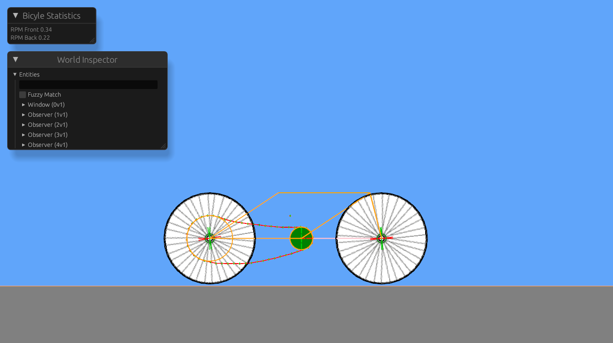

# Bevy Bicycle

Bevy Bicycle is an attempt at using Bevy and Bevy Avian to create a 2D Bicyle Sandbox.

In the Future, I'd like to implement the ability to alter both the chainring and cassette cog sizes using a gui.

## Controls

Press R to setup the chain.

